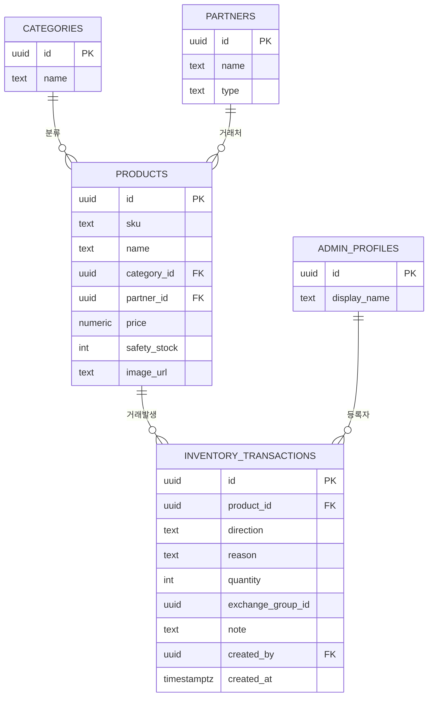

# HOME+I 재고 관리 시스템 (홈)

텔레그램 채널로 운영하던 입고/출고 재고 관리를, **실시간 재고 추적 웹사이트**로 전환하는 프로젝트입니다.

- **버전 관리**: GitHub
- **DB / 백엔드**: Supabase (PostgreSQL, Auth, RLS)
- **배포**: Vercel

---

## 📌 프로젝트 개요

| 구분 | 내용 |
|---|---|
| 목적 | 텔레그램 채널 기반 재고 관리를 웹사이트로 대체/보완 |
| 공개 접근 | 재고 조회(메인 리스트, 검색)는 비로그인 사용자도 가능 |
| 관리자 전용 | 거래 등록, 거래 이력 조회는 로그인 필요 |
| 핵심 원칙 | 재고 수량은 저장하지 않고, 거래 로그를 집계해 실시간 계산 |

---

## 🗂 ERD (테이블 관계도)



> GitHub는 Mermaid 문법을 자동으로 다이어그램으로 렌더링하므로, 저장소에 올리면 위 코드가 바로 도표로 보여요.

---

## 🔄 거래 유형(Transaction) 구조

`direction`(대분류) + `reason`(세부 사유) 조합으로 모든 입출고를 표현합니다.

| direction | reason | 설명 |
|---|---|---|
| IN | PURCHASE | 매입 입고 |
| IN | RETURN | 반품 재입고 |
| IN | EXCHANGE_IN | 교환으로 인한 입고 |
| OUT | SALE | 판매 출고 |
| OUT | SAMPLE | 샘플 출고 |
| OUT | EXCHANGE_OUT | 교환으로 인한 출고 |
| ADJUST | ADJUSTMENT | 재고 조사 등 수동 조정 |

- 교환은 `EXCHANGE_OUT` + `EXCHANGE_IN` 두 건의 거래를 `exchange_group_id`(UUID)로 묶어서 처리합니다 (다른 상품으로의 교환도 지원).

---

## 🔐 인증 / 권한 정책

- **비로그인(anon)**: 상품 목록, 검색, 실시간 재고(`current_stock`) 조회 가능
- **로그인(authenticated)**: 거래 등록, 거래 이력 조회 가능
- 공개 회원가입은 비활성화되어 있으며, 관리자 계정은 Supabase 대시보드에서 수동 생성합니다.
- 거래 등록 시 `created_by`에 `auth.uid()`가 자동 기록되어, 이력에 담당 관리자명이 표시됩니다.

---

## 🚀 시작하기

### 1) Supabase 프로젝트 생성 후 스키마 적용

```bash
# Supabase SQL Editor에 supabase/schema.sql 내용을 붙여넣고 실행
```

### 2) 환경변수 설정

`.env.example`을 복사해서 `.env.local`을 만들고 값을 채워주세요.

```bash
cp .env.example .env.local
```

### 3) 로컬 개발 서버 실행

```bash
npm install
npm run dev
```

### 4) Vercel 배포

Vercel에 GitHub 저장소를 연결하고, 위 환경변수를 Vercel 프로젝트 설정에도 동일하게 등록하면 push할 때마다 자동 배포됩니다.

---

## 📁 폴더 구조

```
homei-inventory/
├── supabase/
│   └── schema.sql       # DB 스키마 + RLS 정책
├── docs/                # 설계 문서 (필요 시 추가)
├── .env.example
├── .gitignore
└── README.md
```

---

## 🗺 다음 단계 (TODO)

- [ ] Supabase 프로젝트 생성 및 스키마 적용
- [ ] Next.js 프론트엔드: 메인 페이지 (검색/필터/요약 통계/상품 리스트)
- [ ] Next.js 프론트엔드: 상세 페이지 (거래 등록 폼 + 이력 테이블)
- [ ] Vercel 배포 및 환경변수 설정
